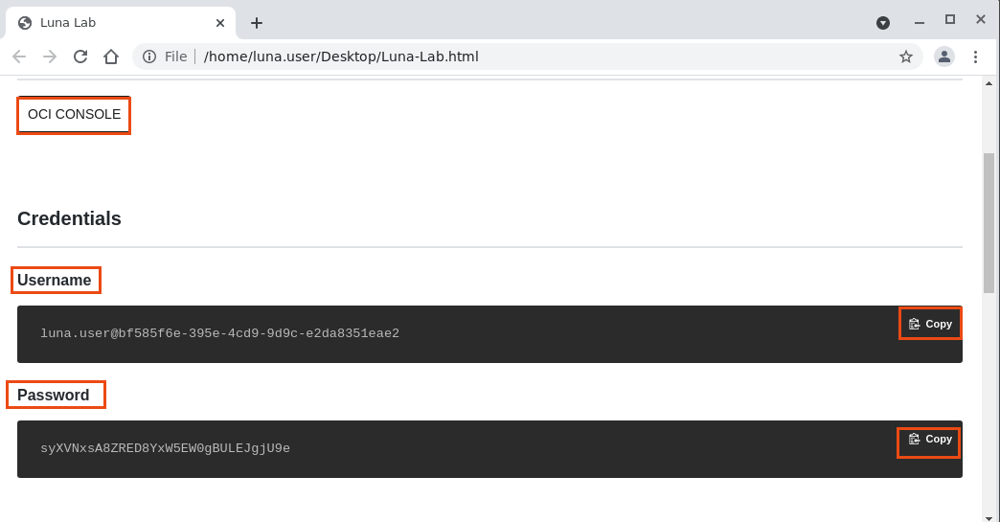
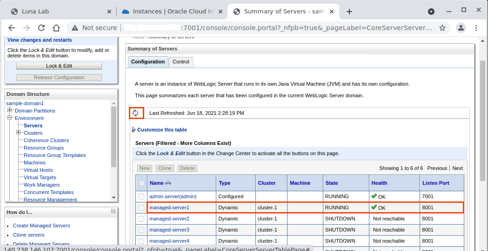
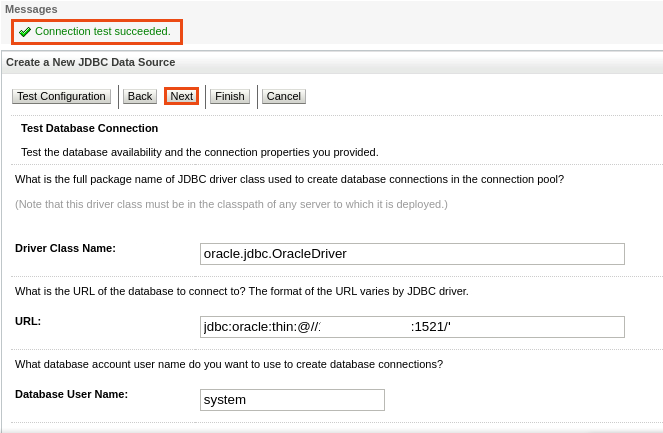
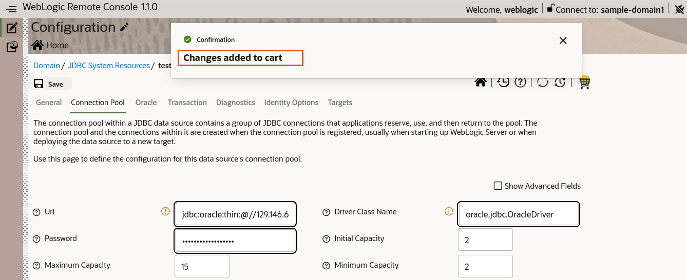

# WebLogic Basic Lab

## Intro to WebLogic Server

## Typical topology
Admin Server + Managed server

## Connectivity to Database

DataSources + Connection poooling

## Running and deploying JavaEE applications

Paragraph about this


## Running WebLogic Server in Docker

This lab uses the Docker image with WebLogic domain inside the image deployment. We do it as this is the easiest way nowadays to provision lab environments and provision Weblogic in testing and development environments. We avoid process of installing Java, WebLogic Server binaries and configuring the domain. This means that all the artifacts and domain-related files are stored within the image. 

## WebLogic-Remote-Console

During these labs we will be using the latest WebLogic Server console that runs outside of the context of the Admin Server. It will run on the desktop of the Administrator. It is called WebLogic Remote Console  and it is a lightweight, open-source console that you can use to manage your WebLogic Server domain running anywhere, such as on a physical or virtual machine, in a container, Kubernetes, or in the Oracle Cloud. The Remote Console does not need to be co-located with the WebLogic Server domain.

You can install and run the Remote Console anywhere, and connect to your domain using WebLogic REST APIs. You simply launch the desktop application and connect to the Administration Server of your domain. Or, you can start the console server, launch the console in a browser and then connect to the Administration Server.

The Remote Console is fully supported with WebLogic Server 12.2.1.3, 12.2.1.4, and 14.1.1.


### Key Features of the WebLogic Remote Console

The WebLogic Remote Console provides an alternative WebLogic Server administration GUI that enables REST-based access to WebLogic management information, in alignment with current cloud-native trends. When connected to a WebLogic domain using the Remote Console, you can:
- Configure WebLogic Server instances
- Configure WebLogic Server clusters
- Configure WebLogic Server services, such as database connectivity (JDBC), and messaging (JMS)
- Deploy and Un-deploy applications
- Start and stop servers and applications
- Monitor server and application performance
- View server and domain log files
- View application deployment descriptors
- Edit selected runtime application deployment descriptor elements

### Difference with the WebLogic Server Administration Console

If you are already familiar with the WebLogic Server Administration Console deployed as part of your WebLogic domain, you'll notice these key differences in the WebLogic Remote Console:

- The user interface has been completely redesigned to conform to the Oracle Alta UI Design system and the Oracle Redwood theme included with Oracle JET.
- The configuration and monitoring content is separated into separate pages in the Remote Console. In the WebLogic Server Administration Console, the configuration and runtime information are presented on one page. See [Separation of Configuration and Runtime Data](https://github.com/oracle/weblogic-remote-console/blob/master/site/console_uidesign.md#separation).
- The Change Center is now expressed as a shopping cart. See [Use the Shopping Cart](https://github.com/oracle/weblogic-remote-console/blob/master/site/console_uidesign.md#cart).
- Instead of logging directly into the Administration Console deployed in a WebLogic domain, the Remote Console connects to the Administration Server in a WebLogic domain, with the credentials supplied by the user, using WebLogic REST APIs.

##  Steps 1: Login to OCI console and Navigating through Resources

- On the Desktop, Click on **Luna-Lab.html** file.


- This Luna-Lab.html file contains the Credentials for your oracle cloud account which you will use for this lab.



- Click on **OCI CONSOLE**. It opens a new tab. Click on **Copy** for copying **Username** and **Password** and paste it on new tab as shown below. Click on **Sign In**.


- Get Started page open up, where you have Quick Actions links for creating various resources.


- Let’s navigate through the resources, which we provisioned for you as part of this Lab. 
- Click on **Hamburger menu** on the left upper corner, then click on **Compute -> Instances**.


- In the **Compartment**, Select the compartment which is under the **Luna-Labs** as shown below.


- You can see the Instance in this section, which we will use in this lab. Click on the **Instance**.


- This page contains the details about this Instance, just note down the **Public IP Address**, which we will use later stage.


> Note: In Furthers steps, we will mention this Public IP Address as **<Public_Ip_Of_Instance>**. So, you just need to replace <Public_Ip_Of_Instance> with this Public IP Address.

> Leave this tab open in browser. We can use this to copy Public IP of Instance.

## Steps 2: Starting Admin Server in Docker Container

- Right Click on Luna Desktop and Click on Open Terminal Here.


```bash
ssh -i ../.ssh/id_rsa opc@<Public_Ip_Of_Instance>
```

> Note: Here, **id_rsa** is private key which we need to access to the Instance. **‘<Public_Ip_Of_Instance>’** is Public IP of your instance, which you noted down in earlier steps. Type **yes** when asked as shown below.


```bash
docker run -p 7001:7001 --network='bridge' --name='WLSADMIN' --rm iad.ocir.io/weblogick8s/weblogic-operator-tutorial-store:1.0 /u01/oracle/user_projects/domains/sample-domain1/bin/startWebLogic.sh
```


> Note: This docker command initially search for this image locally. If not found, it downloads the image from **Oracle Public Repository**. This image has WebLogic Domain embedded in it. Later this command also start the admin server in container on port number 7001 and also map this port to 7001 port in host machine.

- Open a new tab in Chrome Browser and type the **http://<Public_IP_of_Instance>:7001/console**. It will open Admin console. Enter **weblogic/welcome1** as **Username/Password** then click on **Login**.


- Click on **Environment-> Servers** and Observe the Managed servers in cluster and Admin Server.


## Steps 3: Starting Managed Server in Docker Container

- Open a new Terminal.

```bash
ssh -i ../.ssh/id_rsa opc@<Public_Ip_Of_Instance>
```


```bash
docker run -p 8001:8001 --network='bridge' --name='WLSMS1' --rm iad.ocir.io/weblogick8s/weblogic-operator-tutorial-store:1.0 /u01/oracle/user_projects/domains/sample-domain1/bin/startManagedWebLogic.sh managed-server1 t3://<Public_Ip_Of_Instance>:7001 -Dweblogic.management.username=weblogic -Dweblogic.management.password=welcome1
```


> Note: As image is already downloaded in local repositories. Thus, it starts the **managed-server1** at port number 8001 in container (map to port 8001 in host machine). Here we need to authenticate while connecting to admin server.

- Go to the WebLogic Admin Console. And Click on **Refresh icon** to verify Managed Server is in **RUNNING** State.



## Steps 4: Creating JDBC Data-Source through Admin Console

- On the Desktop, Click on **Luna-Lab.html** file.

- This Luna-Lab.html file contains the Credentials for your oracle cloud account which you will use for this lab.

- Click on **OCI CONSOLE**. It opens a new tab. Click on Copy for copying Username and Password and paste it on new tab as shown below.

- Click on **Sign In**.

- Click on **Hamburger menu** in upper left corner, then click on **Oracle Database -> Bare Metal, VM and Exadata**.


- Select the Same **Compartment** and Click on DB System **DBWLS** which is created for you.


- Click on the Databases **DBWLS** as shown below.


- Click on **DB Connection** tab, Then Click on **Show** in **Easy Connect**. It will provide the **Connection String** Which we will use for using this database.


> Note: You need to note some information like **Hostname**, **DB name** and **User name**. This information will be required, when we will create JDBC data source in next steps.

- Go back to browser and open a WebLogic Admin Console at **http://<Public_Ip_Of_Instance>:7001/console** . Use **weblogic/welcome1** as **Username/Password** then click on **Login**.

- Click on **Lock & Edit**.


- Click on **Services-> Data Sources-> New-> Generic Data Source**.


- Enter the Following Details and click on **Next**.

> 	Name:     			  testDS

> 	Scope:		      		  Global

> 	JNDI Name:		      	  jdbc/testDS

> 	Database Type:			  Oracle


- Select the Database Driver as **“Oracle Driver (Thin) for Service Connection; Version: Any”** and click on **Next**.


- Leave Default on Next Screen and click on **Next**.


- Enter the following information for Database connection and click on **Next**.

>  Database Name, Host Name details can be found in DB Connection String.

>   	Port:	 			1521

>   	Database User Name:		system

>   	Password:			AAaa11##1


> Note: If you find out that you don’t have Oracle Database configured in your oracle cloud account. Then for completing this lab, you can use the below credentials.


>           Hostname:		129.146.60.235 <Public_Ip_of_Instance_Containing_DB>

>           DB Name:		DBWLS_phx16j.sub06110437450.ankitvcn.oraclevcn.com

>           Username:		system

>	    Password:		AAaa11##1

- Click on **Test Configuration**.  You will see message **“Connection test succeeded”**. Click on **Next**.




- Select **‘admin-server’** as **Select Targets** and click on **Finish**.


- Click on **“Activate Changes”**. 


- As part of this lab, we have deployed one web application in domain. Click on **Deployments**.


> Note: We have **testwebapp** deployed in **cluster**

- Go to Browser and type the following URL **http://<Public_Ip_Of_Instance>:8001/opdemo/?dsname=testDS**.


> This application will provide you information about **Datasource name**, **Database URL** and **Database User**.

> Note: Here **managed-server1** is running at port number **8001** and context for application is **‘/opdemo’**. So, once you provide the **Datasource name** in URL, it will provide you the Database URL for this Datasource.

  
## Steps 5: Deployment of Application on Managed Server

- Open a new terminal.

```bash
curl -LSs https://github.com/pandey-ankit/WebLogic-Basic-Lab/blob/main/aussie-tripper-v1.ear?raw=true > aussie-tripper-v1.ear
```
 


> Note: This command downloads the application **aussie-tripper-v1.ear** from git repository and put it in Desktop. 

  
- Go to Admin Console **http://<Public_Ip_of_Instance>:7001/console**  and Click on **Deployments**.


- Click on **Lock & Edit**.


- Click on **Install**.


- Click on **“Upload your file(s)”**.


- Click on **“Choose File”** in **Deployment Archive**.


- Select the **aussie-tripper-v1.ear** file in **/home/luna.user/Desktop/** folder and click on **Open**.


- Click on **Next**.


- On Next Page, Select the **aussie-tripper-v1.ear** file and then click on **Next**.


- Select **“Install this deployment as an application”** and then click on **Next**.


- Select **“cluster-1”** as Available targets for aussie-tripper-v1 and then click on **Next**.


- On Next page, Click on **Finish**.


- Click on **“Activate Changes”**.


- Select the **Control tab** and then check the box for **“aussie-tripper-v1”** app and click on **Start->Servicing all request**.


- Click on **“Yes”**.


  
- Open a new tab in Chrome Browser and open **http://<Public_IP_Of_Instance>:8001/aussie-tripper/**


- You can add Trips by Click on Different Destination and you can also Clear Trips as well.

## Steps 6: Accessing Admin Server using WebLogic-Remote-Console

- Copy the following URL[WebLogic-Remote-Console](https://github.com/oracle/weblogic-remote-console/releases)  and paste it on new tab in browser. Download the file **console.zip**.


- Open a new terminal.

```bash
cd /home/luna.user/Downloads/
```

```bash
unzip console.zip
```


```bash
java -jar console/console.jar
```


- It starts the WebLogic Remote Console. Go to Browser and paste the URL **http://localhost:8012/**


- Enter the Following details and click on **Connect**.

> 	Username:		weblogic

> 	Password:		welcome1

> 	URL:			http://<Public_IP_Of_Instance>:7001


## Re-Configuration of JDBC Datasource through WebLogic-Remote-Console

- As we connect to Admin Server, we observe two options: **Configuration** and **Monitoring**.


- Click on the **Configuration Icon -> Services-> JDBC System Resources-> testDS-> Connection Pool** as shown in below image.


- Click on **Hamburger menu** in the upper left corner and then press **F11** to enter full screen.


- Change the **Initial Capacity** and **Minimum Capacity** from **1** to **2** in **Connection Pool** tab and then click on **Save**.


 
- It shows **“Changes added to the cart”**.



- Click on the **Shopping Cart Icon** and then click on **Commit Changes**.


- Go to Admin Console **http://<Public_IP_Of_Instance>:7001/console** and verify the changes we made through **WebLogic-Remote-Console**.


- Click on **Services-> Data Sources-> testDS-> Connection Pool**.


 
- Verify the **Initial Capacity** and **Minimum Capacity**.


## Monitoring through WebLogic-Remote-Console

- Click on **Monitoring Icon -> Running Servers-> managed-server1->Deployments-> aussie-tripper-v1_v1->Component Runtimes-> managed-server1/aussie-tripper**. 


- Click on **Hamburger menu** of upper left corner and you may observe the **Session Opened Total Count** is equal to **1**.


	
- Go to browser and open a **New Incognito window**.


- Open aussie-tripper home page: **http://<Public_IP_of_Instance>:8001/aussie-tripper/**.


  
- Go back to **WebLogic-Remote-Console** and click on **Refresh Icon**.


- Verify the **open session count** as **2**.


