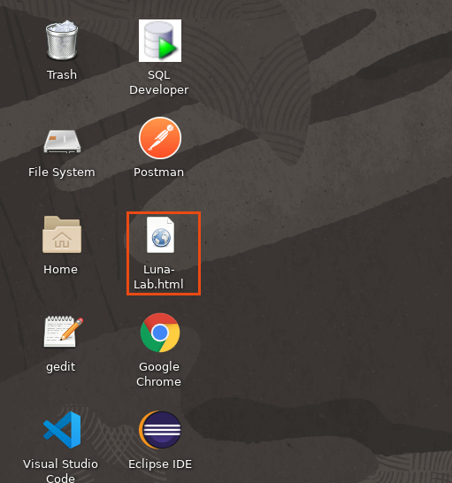
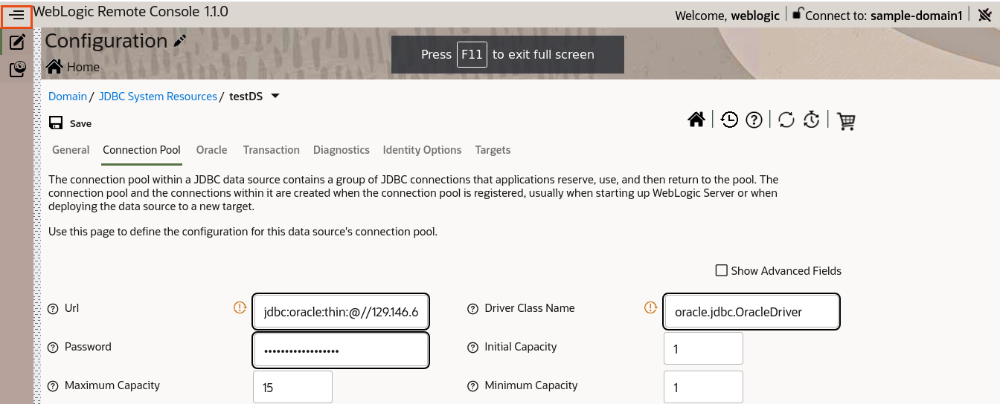
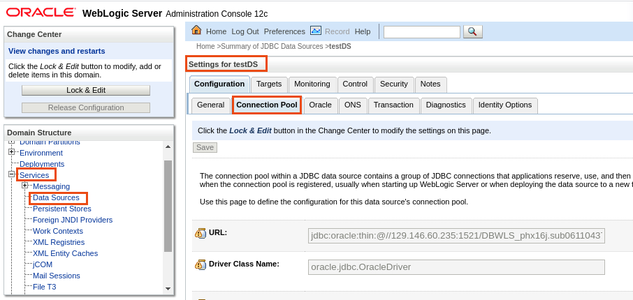

# WebLogic Basic Lab

## About WebLogic Server

Oracle WebLogic Server is a unified and extensible platform for developing, deploying and running enterprise applications, such as Java, for on-premise and in the cloud. WebLogic Server offers a robust, mature, and scalable implementation of Java Enterprise Edition(EE) and Jakarta EE.

To Know more about Oracle WebLogic Server. Please click on the following link [Oracle-WebLogic-Server](https://www.oracle.com/in/java/weblogic/).

## Typical Topology Used for this Lab

In this lab, We are using Embedded WebLogic domain **sample-domain1**. This image has the following structures.


Using the Oracle WebLogic Server domain image, we can have two types of containers:
1. Admin Server container with a single Oracle WebLogic Server Admin Server.
2. Managed Server container

These Docker containers enable users to create clustered and non-clustered Oracle WebLogic Server domain configurations. Each server running in the domain runs in its own Docker container and is capable of communicating as required with other servers on the same host.

In the **sample-domain1**, we have a Dynamic cluster **cluster-1** which has 5 managed server configured.In this Lab, using **docker run** we will run **one Admin Server container** and **one Managed Server container**.

We have the following advantages of this topology.

- Good for traditional-like deployments.

- Easy to deploy containers from Oracle WebLogic Server domain images.

- Easy to scale up and down the cluster.

- Good for developers.

- No need to install or configure anything on host except for Docker binaries.

## Connectivity to Database

In WebLogic Server, you can configure database connectivity through JDBC datasource, either in your WebLogic domain configuration or in your enterprise application. A datasource is a Java EE standard method of configuring connectivity to a database. Each WebLogic data source contains a pool of database connections. 

Applications look up the datasource on the JNDI tree or in the local application context and then use a database connection from the pool of connections. Data sources and their connection pools provide connection management processes that help keep your system running efficiently.

WebLogic communicates with the database through a connection pool. The connection pool enables WebLogic to use a fixed number of connections to databases rather than incur the overhead of constantly creating and disposing of connections.

## Running and deploying JavaEE applications on WebLogic

WebLogic Server implements the Java EE 7 specification. Java EE 7 includes a deployment specification, JSR-88, that describes a standard API used by deployment tools and application server providers to configure and deploy applications to an application server.

The WebLogic Server configuration generated by a Java EE deployment API configuration process is stored in a deployment plan and one or more generated WebLogic Server deployment descriptor files as shown in below images


## Running WebLogic Server in Docker

This lab uses the Docker image with WebLogic domain inside the image deployment. We do it as this is the easiest way nowadays to provision lab environments and provision Weblogic in testing and development environments. We avoid process of installing Java, WebLogic Server binaries and configuring the domain. This means that all the artifacts and domain-related files are stored within the image. 

## WebLogic-Remote-Console

During these labs we will be using the latest WebLogic Server console that runs outside of the context of the Admin Server. It will run on the desktop of the Administrator. It is called WebLogic Remote Console  and it is a lightweight, open-source console that you can use to manage your WebLogic Server domain running anywhere, such as on a physical or virtual machine, in a container, Kubernetes, or in the Oracle Cloud. The Remote Console does not need to be co-located with the WebLogic Server domain.

You can install and run the Remote Console anywhere, and connect to your domain using WebLogic REST APIs. You simply launch the desktop application and connect to the Administration Server of your domain. Or, you can start the console server, launch the console in a browser and then connect to the Administration Server.

The Remote Console is fully supported with WebLogic Server 12.2.1.3, 12.2.1.4, and 14.1.1.


### Key Features of the WebLogic Remote Console

The WebLogic Remote Console provides an alternative WebLogic Server administration GUI that enables REST-based access to WebLogic management information, in alignment with current cloud-native trends. When connected to a WebLogic domain using the Remote Console, you can:
- Configure WebLogic Server instances
- Configure WebLogic Server clusters
- Configure WebLogic Server services, such as database connectivity (JDBC), and messaging (JMS)
- Deploy and Un-deploy applications
- Start and stop servers and applications
- Monitor server and application performance
- View server and domain log files
- View application deployment descriptors
- Edit selected runtime application deployment descriptor elements

### Difference with the WebLogic Server Administration Console

If you are already familiar with the WebLogic Server Administration Console deployed as part of your WebLogic domain, you'll notice these key differences in the WebLogic Remote Console:

- The user interface has been completely redesigned to conform to the Oracle Alta UI Design system and the Oracle Redwood theme included with Oracle JET.
- The configuration and monitoring content is separated into separate pages in the Remote Console. In the WebLogic Server Administration Console, the configuration and runtime information are presented on one page. See [Separation of Configuration and Runtime Data](https://github.com/oracle/weblogic-remote-console/blob/master/site/console_uidesign.md#separation).
- The Change Center is now expressed as a shopping cart. See [Use the Shopping Cart](https://github.com/oracle/weblogic-remote-console/blob/master/site/console_uidesign.md#cart).
- Instead of logging directly into the Administration Console deployed in a WebLogic domain, the Remote Console connects to the Administration Server in a WebLogic domain, with the credentials supplied by the user, using WebLogic REST APIs.

## Lab scenario ##

You will:
- Start Admin and Managed servers (as docker containers)
- Verify that those two are up and running by connecting to Weblogic Admin Console
- Create JDBC Connection Pool and establish connection between Weblogic and Oracle DB
- Deploy sample application and verify that it is up and running
- Setup WebLogic Remote Console to do some basic configuration and monitoring


##  Step 1: Login to OCI console and Navigating through Resources

Due to the limitations of the Luna environment we can't start the docker directly on Luna desktop. So we need to ask you to connect to the "external" compute VM where Docker was already provisioned. This step indicates how to find out the IP of that compute VM where you will be starting WebLogic Server

1. On the Desktop, Click on **Luna-Lab.html** file.



2. This Luna-Lab.html file contains the Credentials for your oracle cloud account which you will use for this lab.


3. Click on **OCI CONSOLE**. It opens a new tab. Click on **Copy** for copying **Username** and **Password** and paste it on new tab as shown below. Click on **Sign In**.


4. Get Started page open up, where you have Quick Actions links for creating various resources.


5. Let’s navigate through the resources, which we provisioned for you as part of this Lab. 
6. Click on **Hamburger menu** on the left upper corner, then click on **Compute -> Instances**.


7. In the **Compartment**, Select the compartment which is under the **Luna-Labs** as shown below.


8. You can see the Instance in this section, which we will use in this lab. Click on the **Instance**.


9. This page contains the details about this Instance, just note down the **Public IP Address**, which we will use later stage. 


> Note: In Furthers steps, we will mention this Public IP Address as **<Public_Ip_Of_Instance>**. So, you just need to replace <Public_Ip_Of_Instance> with this Public IP Address of the VM where will be starting WebLogic domains.

> Leave this tab open in browser. We can use this to copy Public IP of Instance.

## Step 2: Starting Admin Server in Docker Container

Once we collected information about the IP of the VM where we will start WebLogic Server in that step you will connect to that VM (through SSH) and download (pull) image that contains the binaries of WebLogic and some sample domain confirguration. After this you will start Admin Server from sample WebLogic domain and you will try to open WebLogic Admin console to verify that the Admin server is up and running.

1. Right Click on Luna Desktop and Click on Open Terminal Here.


2. Connect to VM as opc user using SSH

```bash
ssh -i ../.ssh/id_rsa opc@[REPLACE_THIS_WITH_THE_Public_Ip_Of_Instance]
```

> Note: Here, **id_rsa** is private key which we need to access to the Instance. **[REPLACE_THIS_WITH_THE_Public_Ip_Of_Instance]** part of the command should be replaced with the Public IP of your VM that you have identified in Step 1. Type **yes** when asked as shown below.


3. Start WebLogic Admin Server inside Docker.

The image with the sample domain is stored in OCIR registry (registry in Oracle Cloud). The server will open inside the container port 7001. And this port will be mapped to port 7001 of the VM. So the admin server will be accessible through port 7001 of our VM.

```bash
docker run -p 7001:7001 --network='bridge' --name='WLSADMIN' --rm iad.ocir.io/weblogick8s/weblogic-operator-tutorial-store:1.0 /u01/oracle/user_projects/domains/sample-domain1/bin/startWebLogic.sh
```


> Note: This docker command initially search for this image locally. If not found, it downloads (pulls) the image from **Oracle Public Repository**. This image has WebLogic Domain embedded in it. Later this command also start the admin server in container on port number 7001 and also map this port to 7001 port in host machine.

4. Open a new tab in Chrome Browser and type the **http://[REPLACE_THIS_WITH_THE_Public_Ip_Of_Instance]:7001/console**. It will open Admin console. Enter **weblogic/welcome1** as **Username/Password** then click on **Login**.


5. Verify the configuration of the domain and verify that the Admin Server is properly up and running. To do this please click on **Environment-> Servers** and check that all the Managed servers are in **SHUTDOWN** state and Admin Server is in the **RUNNING** state.


## Step 3: Starting Managed Server in Docker Container

In this step you will start another Docker container that will run one of the configured Managed Servers. We will use the same VM. So the Admin Server and the Managed Server will run in the same VM. Admin Server had openned the port 7001. While the managed server will listen on the port 8001.

1. Right click on the Desktop and then click on **Open Terminal Here**.


2. Connect through SSH to the VM where we are planning to run WebLogic
	
```bash
ssh -i ../.ssh/id_rsa opc@[REPLACE_THIS_WITH_THE_Public_Ip_Of_Instance]
```


	
3. Start Managed Server as Docker container

We will use the same image as we were using in Step 2. This time we will start another process within the context of that Docker container (Managed Server instead of Admin Server). The Managed Server intends to open and bind to port 8001 of our VM	

```bash
docker run -p 8001:8001 --network='bridge' --name='WLSMS1' --rm iad.ocir.io/weblogick8s/weblogic-operator-tutorial-store:1.0 /u01/oracle/user_projects/domains/sample-domain1/bin/startManagedWebLogic.sh managed-server1 t3://<Public_Ip_Of_Instance>:7001 -Dweblogic.management.username=weblogic -Dweblogic.management.password=welcome1
```


> Note: As image is already downloaded in local repositories. Thus, it starts the **managed-server1** at port number 8001 in container (map to port 8001 in host machine). Here we need to authenticate while connecting to admin server.

4. Go to the WebLogic Admin Console (that you have oopened in Chrome browser in step 2). You have left console on the Servers page in Step 2. So if you haven't navigate away from that page then it is enough just to click on **Refresh icon** to verify Managed Server named "manged-server1" is in **RUNNING** State. If you navigated away on the console from the Servers page you need navigate back to that page (as described in the Step 2)


## Step 4: Creating JDBC Data-Source through Admin Console

WebLogic Server connects to Datbase(s) through mechanism called connection pooling. So the application server opens set of precreated connections that are reused by the applications. So once the application needs to utilize the precreated connection then it uses the API to find proper Connection Pool (the API is called DataSource API) and asks Connection Pool to "borrow" a connection for a moment. It is the Application developer responsibility to "return" the connection to the pool once the connection is not needed anymore. In this step we will explain how to configure DataSource object in WebLogic Server so the applications my interact with the Connection Pool mechanism and find proper DataSource.
	
In the Luna environment we created for you simple running Oracle DB. And in this lab we will demonstrate how to connect to that DB.

1. On the Desktop, Click on **Luna-Lab.html** file.

2. This Luna-Lab.html file contains the Credentials for your oracle cloud account which you will use for this lab.

3. Click on **OCI CONSOLE**. It opens a new tab. Click on Copy for copying Username and Password and paste it on new tab as shown below.

4. Click on **Sign In**.

5. Click on **Hamburger menu** in upper left corner, then click on **Oracle Database -> Bare Metal, VM and Exadata**.


6. Select the Same **Compartment** and Click on DB System **DBWLS** which is created for you.


7. Click on the Databases **DBWLS** as shown below.


8. Click on **DB Connection** tab, Then Click on **Show** in **Easy Connect**. It will provide the **Connection String** Which we will use for using this database.


> Note: You need to note some information like **Hostname**, **DB name** from **Connection String**.

> If **mydb.sub06110437450.ankitvcn.oraclevcn.com:1521/DBWLS_phx16j.sub06110437450.ankitvcn.oraclevcn.com** is your connection string, then it is <**HostName**>:1521/<**DBName**> format.So in this case **Hostname** is *mydb.sub06110437450.ankitvcn.oraclevcn.com* and **DBName** is *DBWLS_phx16j.sub06110437450.ankitvcn.oraclevcn.com*. 
	
> Below are the Value of **Username** and **Password** for the above Database.
	
>		Username:		system
>		Password:		AAaa11##1
	
> This information will be required, when we will create JDBC data source in next steps.

9. Go back to browser and open a WebLogic Admin Console at **http://[REPLACE_THIS_WITH_THE_Public_Ip_Of_Instance]:7001/console** . Use **weblogic/welcome1** as **Username/Password** then click on **Login**.

10. The configuration changes require to open the "Edit" session. So you need to click on **Lock & Edit**.


11. Click on **Services-> Data Sources-> New-> Generic Data Source**.


l2. Enter the Following Details and click on **Next**.

> 	Name:     			  testDS

> 	Scope:		      		  Global

> 	JNDI Name:		      	  jdbc/testDS (this is the name that Application will use to find Connection Pool)

> 	Database Type:			  Oracle


13. Select the Database Driver as **“Oracle Driver (Thin) for Service Connection; Version: Any”** and click on **Next**.


14. Leave Default on Next Screen and click on **Next**.


15. Collect the following information from Connection String in the Oracle Database Page.

The syntax of Connection string is following  **HostName**:1521/**DBName**.
So please note from the connection string both:  **HostName** and **DBName** - we will need them later


	
> Below are the Value of **Username** and **Password** for the above Database.
	
>		Username:		system
>		Password:		AAaa11##1

16. So you need to Enter your values  for **Hostname** and **DBName** from connection string similar to below one and click on **Next**.

>	 		Database Name:			[REPLACE IT WITH DBName read above]
>			Host Name:			[REPLACE IT WITH HostName read above]
>   			Port:	 			1521
>   			Database User Name:		system
>   			Password:			AAaa11##1


	
> Note: If you find out that you don’t have Oracle Database configured in your oracle cloud account. Then for completing this lab, you can use the DB credentials in https://github.com/pandey-ankit/WebLogic-Basic-Lab/blob/main/DBREADME.md.


17. Click on **Test Configuration**.  You will see message **“Connection test succeeded”**. Click on **Next**.


18. Select **‘admin-server’** as **Select Targets** and click on **Finish**.


- Click on **“Activate Changes”**. This will end "Edit" session and apply changes


19. The demo image that we are using is having one preconfigured web application that is running on Managed Server. This preconfigured web app allows you to test and verify all JDBC Connection parameters from DataSource. Click on **Deployments**.


> Note: We have **testwebapp** deployed in **cluster**

- Go to Browser and type the following URL **http://[REPLACE_THIS_WITH_THE_Public_Ip_Of_Instance]:8001/opdemo/?dsname=testDS**.


> This application will provide you information about **Datasource name**, **Database URL** and **Database User**.

> Note: Here **managed-server1** is running at port number **8001** and context for application is **‘/opdemo’**. So, once you provide the **Datasource name** in URL, it will provide you the Database URL for this Datasource.

  
## Step 5: Deployment of Application on Managed Server

In this embedded domain **sample-domain1**, we have dynamic cluster **cluster-1**. In this step we will deploy **aussie-tripper-v1.ear** application to dynamic cluster **cluster-1**.  We already started managed-server1 in step 3. Se here we show, How you deploy an application archive file as an application to the cluster and How you make an application, to start servicing all request. Later, as have only one managed server running  inside the cluster, so we will access the **aussie-tripper** application on managed-server1 port 8001.
	
1. Right Click on the Desktop, and then click on **Open Terminal Here**.

	
2. Download demo application archive
	
```bash
curl -LSs https://github.com/pandey-ankit/WebLogic-Basic-Lab/blob/main/aussie-tripper-v1.ear?raw=true > aussie-tripper-v1.ear
```
 


> Note: This command downloads the application **aussie-tripper-v1.ear** from git repository and put it in Desktop. 

  
3. Go to Admin Console **http://[REPLACE_THIS_WITH_THE_Public_Ip_Of_Instance]:7001/console**  and Click on **Deployments**.


4. Making application deployment requires making changes in the Weblogic configuration so you need to click on **Lock & Edit** first to start "Edit" session.


5. Click on **Install**.


6. Click on **“Upload your file(s)”**.


7. Click on **“Choose File”** in **Deployment Archive**.


8. Select the **aussie-tripper-v1.ear** file in **/home/luna.user/Desktop/** folder and click on **Open**.


9. Click on **Next**.


10. On Next Page, Select the **aussie-tripper-v1.ear** file and then click on **Next**.


11. Select **“Install this deployment as an application”** and then click on **Next**.


12. Select **“cluster-1”** as Available targets for aussie-tripper-v1 and then click on **Next**.


13. On Next page, Click on **Finish**.


14. Click on **“Activate Changes”**.


15. Select the **Control tab** and then check the box for **“aussie-tripper-v1”** app and click on **Start->Servicing all request**.


16. Click on **“Yes”**.


  
17. Open a new tab in Chrome Browser and open **http://[REPLACE_THIS_WITH_THE_Public_Ip_Of_Instance]:8001/aussie-tripper/**


18. You can add Trips by Click on Different Destination and you can also Clear Trips as well. Or you can play in another way wth that demo app

## Step 6: Accessing Admin Server using WebLogic-Remote-Console

In this step, first we download the zip file for WebLogic-Remote-Console. As it is required to run the Remote-Console in the browser. Then we unzip the zip file. Later, we start the remote console on Luna environment using the default settings- localhost(127.0.0.1) and port 8012. Then we access the WebLogic-Remote-Console through browser on url **http://localhost:8012**. After that, we will connect to the admin server running in **sample-domain1** by provideing username, password and url.

1. We need to install new lightway console to WebLogic. To do that first Copy the following URL[WebLogic-Remote-Console](https://github.com/oracle/weblogic-remote-console/releases)  and paste it on new tab in browser. Download the file **console.zip**.


2. Open a new terminal and navigate to the folder where you have downloaded binaries of the console.

```bash
cd /home/luna.user/Downloads/
```

3. Extract the archive with the binaries	
	
```bash
unzip console.zip
```


4. Start console as below	
	
```bash
java -jar console/console.jar
```


5. It starts the WebLogic Remote Console. Go to Browser and paste the URL **http://localhost:8012/** This time console works directly on the desktop of luna (not inside VM) so you are using localhost as Hostname for the application. The port 8012 is default port of WebLogic Remote Console


6. You need to connect WebLogic Remote Console with WebLogic Admin Server. The Remote Console relies on REST API. So please enter the Following details and click on **Connect**.

> 	Username:		weblogic
> 	Password:		welcome1
> 	URL:			http://[REPLACE_THIS_WITH_THE_Public_Ip_Of_Instance]:7001


## Re-Configuration of JDBC Datasource through WebLogic-Remote-Console

We can make configuration changes through WebLogic-Remote-Console. So in this step, we make some changes in the JDBC datasource **testDS**, which we created as part of step 4. Initially, in connection pool of **testDS**, we have initial capacity and minimum capacity to 1.  So in this step, using WebLogic-Remote-Console we change the initial capacity and minimum capacity to 2. In WebLogic Admin console, when you make changes, you need to activate changes. Like in step 5, when we deploy an application through admin console, we click on **Activate Changes** to make those changes effective. But here we click on **"Save"**, which make an entry in **Shopping Cart**. Then we need to click on **"Commit Changes"** to make those changes effective. Later, we go to Admin console and verify the changes in initial capacity and minimum capacity. 
	
1. As we connect to Admin Server, we observe two options: **Configuration** and **Monitoring**.


2. Click on the **Configuration Icon -> Services-> JDBC System Resources-> testDS-> Connection Pool** as shown in below image.


3. Click on **Hamburger menu** in the upper left corner and then press **F11** to enter full screen.



4. Change the **Initial Capacity** and **Minimum Capacity** from **1** to **2** in **Connection Pool** tab and then click on **Save**.


 
5. It shows **“Changes added to the cart”**.


6. Click on the **Shopping Cart Icon** and then click on **Commit Changes**.


7. Go to Admin Console **http://[REPLACE_THIS_WITH_THE_Public_Ip_Of_Instance]:7001/console** and verify the changes we made through **WebLogic-Remote-Console**.


8. Click on **Services-> Data Sources-> testDS-> Connection Pool**.


 
9. Verify the **Initial Capacity** and **Minimum Capacity**.


## Monitoring through WebLogic-Remote-Console

We can also perform monitoring through WebLogic-Remote-Console. In Step 5, we have deployed **aussie-tripper** application to **cluster-1** and we accessed the application running on **managed-server1**. In this step, we will show, How you can monitor **"Open Session Count"** for **aussie-tripper** application running on **managed-server1**. So number of the open sessions should be equal to 1 right now on the monitoring page. We will simulate another such session. So we open a **New Incognito Window** in Chrome Browser, and access the application **aussie-tripper** running on **managed-server1**. Then we will show you through WebLogic-Remote-Console, How the **Open Session Count** has changed from 1 to 2 now.
	
1. Click on **Monitoring Icon -> Running Servers-> managed-server1->Deployments-> aussie-tripper-v1_v1->Component Runtimes-> managed-server1/aussie-tripper**. 


2. Click on **Hamburger menu** of upper left corner and you may observe the **Session Opened Total Count** is equal to **1**. IF you have already accessed to that application before from more than one browser then number of the sessions could reflect this.


	
3. Go to browser and open a **New Incognito window**.


4. Open aussie-tripper home page: **http://[REPLACE_THIS_WITH_THE_Public_Ip_Of_Instance]:8001/aussie-tripper/**.


  
5. Go back to **WebLogic-Remote-Console** and click on **Refresh Icon**.


6. Verify the **open session count** as **2**. (or another increased value)


